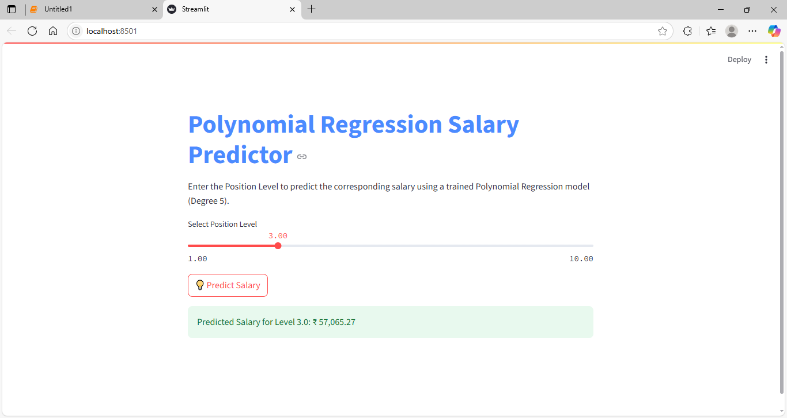

## 📘 Polynomial Regression Salary Predictor using Python

A simple Machine Learning project to model **non-linear relationships** between job levels and salary using **Polynomial Regression**. Includes a live prediction interface using **Streamlit**.

---

### 🚀 Features

* 📈 Fits salary vs job level using Polynomial Regression (Degree 1 to 7)
* ✅ Visualizes the model for each degree
* 🔍 Compares accuracy of each degree with real-world data
* 💾 Saves the trained model using `pickle`
* 🌐 Deployed as a real-time web app with Streamlit

---

### 📸 Screenshot



---

### 📂 Project Structure

```
polynomial-regression-salary-predictor/
│
├── poly_app.py              # Streamlit app
├── poly_model.pkl           # Trained polynomial model
├── poly_transformer.pkl     # Polynomial feature transformer
├── requirements.txt         # Python dependencies
├── emp_sal.csv              # Dataset (Position, Level, Salary)
├── README.md                # Project documentation (this file)
└── App_output_poly_1.PNG    # App screenshot
```

---

### 📦 Requirements

* Python 3.7+
* `streamlit`
* `scikit-learn`
* `numpy`
* `pandas`
* `matplotlib`

---

### 🛠️ Installation

```bash
git clone https://github.com/yourusername/polynomial-regression-salary-predictor.git
cd polynomial-regression-salary-predictor
pip install -r requirements.txt
```

---

### ▶️ Run the App

```bash
streamlit run poly_app.py
```

Open browser at: [http://localhost:8501](http://localhost:8501)

---

### 📊 Project Highlights

| Degree | Predicted Salary (Level 6) | Notes            |
| ------ | -------------------------- | ---------------- |
| 1      | \~289,939                  | Too high         |
| 2      | \~134,485                  | Underfitting     |
| 3      | \~104,821                  | Worse            |
| 4      | \~143,275                  | Close            |
| 5      | \~152,736                  | ✅ Best fit       |
| 6      | \~149,282                  | ✅ Very good      |
| 7      | \~147,736                  | Still acceptable |

---

### 🧠 Learnings

* Polynomial regression handles **non-linear trends**
* `pickle` is used to **save and reuse models**
* `Streamlit` provides a clean interface for real-time input/output

---

### 🧪 Bonus

Try entering levels like `4.5` or `6.2` in the app to test real-time prediction!

---

### 🙌 Author

**Akshay Bhujbal**
📍 Pune, India & sharjah UAE
