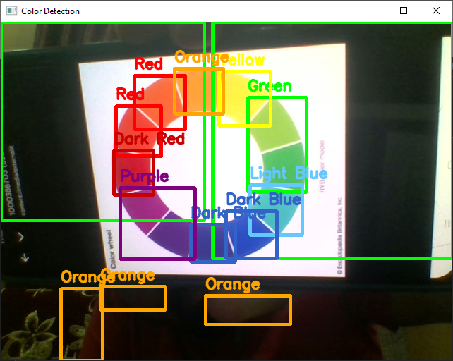

# 🎨 Multi-Color Detection using OpenCV (Day80)

This project demonstrates **real-time multi-color detection** using Python and OpenCV.  
The program detects multiple colors from a webcam feed, draws bounding boxes,  
and labels them with the correct color names.

---

## 📌 Key Features
- Uses **HSV color space** for accurate color detection  
- Detects multiple colors (Red, Green, Blue, Yellow, Purple, etc.)  
- Bounding boxes are drawn in the **same color as detected object**  
- Labels displayed above each detected region  
- Simple and effective **real-time detection**

---

## 💡 Use Cases
- 🚦 Traffic light detection for self-driving systems  
- 🏭 Sorting objects by color in industries  
- 🤖 Robotics vision tasks  
- 🎓 Educational and learning projects  

---

## 🖼 Example Output
Here is a screenshot of the project in action:



👉 This shows how the system detects and labels multiple colors in real-time.

---

## ⚙️ Requirements
- Python 3.x  
- OpenCV (`pip install opencv-python`)  
- Numpy (`pip install numpy`)  

---

## ▶️ How to Run
1. Clone this repository or download the files.  
2. Ensure you have **Python 3.x** installed.  
3. Install dependencies:  
   ```bash
   pip install opencv-python numpy
````
4. Run the script:
    ```bash
   python Color_Detection.py
   
````
5. Press **Esc** to exit the live feed.


## 📚 Learnings

* HSV color space works better than RGB/BGR for color detection.
* Contour detection helps locate regions of interest.
* Real-time detection is possible with simple preprocessing + OpenCV.


