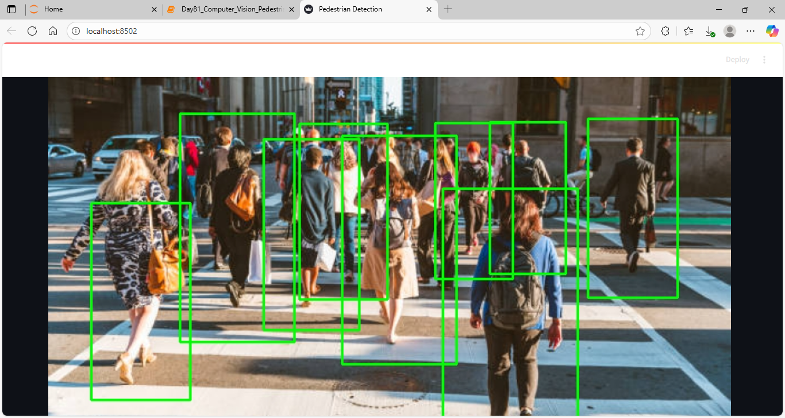
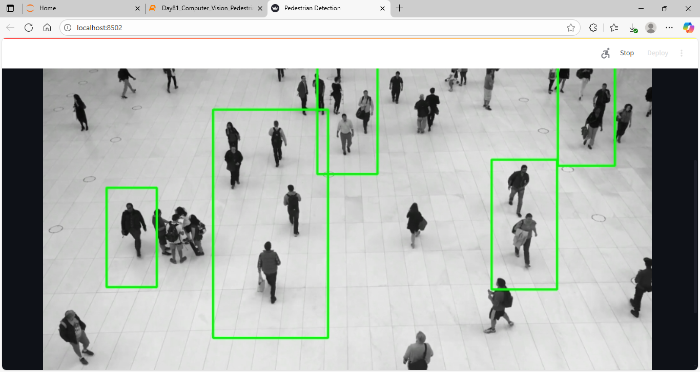
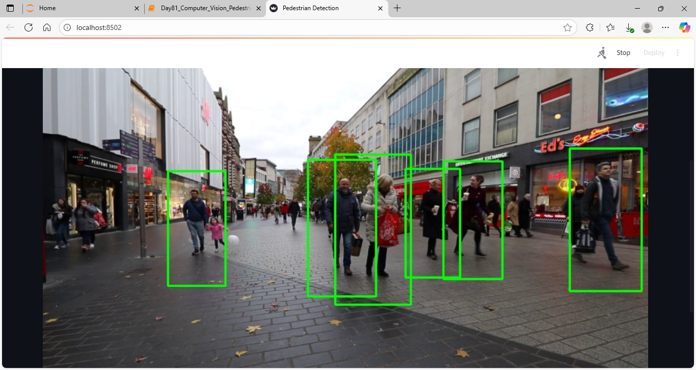

# 🚶 Pedestrian Detection with OpenCV (Haar & HOG+SVM)

## 📌 What We Did
- Built a pedestrian detection system using:
  - **Haar Cascade Classifier**  
  - **HOG + SVM (Histogram of Oriented Gradients + Support Vector Machine)**
- Added Streamlit app for easy demo.
- Tested on images, videos, and webcam input.

---

## ⚡ Why HOG + SVM
- HOG extracts edge/shape features of humans.
- SVM is robust for classification of those features.
- Works better than Haar for walking/side views.
- Good balance of **accuracy vs CPU performance**.

---

## 🖼 Demo Output

### App Interface


### Image Detection


### Video (Wide Angle)


### Video (Close Angle)


---

## ⚠️ Limitations
- Haar Cascade:
  - Misses side/partially visible people.
  - Sensitive to lighting changes.
- HOG + SVM:
  - More robust but **CPU-heavy**.
  - Struggles in crowded or very small-scale scenes.
- Both lag behind **modern deep learning detectors** (YOLOv8, EfficientDet).

---

## 🔮 Future Improvements
- Integrate **YOLOv8** for real-time GPU detection.
- Add **tracking (DeepSORT)** for ID persistence across frames.
- Deploy on **edge devices** using ONNX/TensorRT.
- Improve dataset with background negatives to reduce false positives.

---

## ▶️ Run Demo

```bash
pip install streamlit opencv-python imutils pillow
streamlit run app.py
````

---

## 📂 Project Files

* `Day81_Computer_Vision_Pedestrian_Detection_with_OpenCV_HOG_SVM.ipynb` → Notebook
* `app.py` → Streamlit app
* `Output/` → Screenshots & results

---

