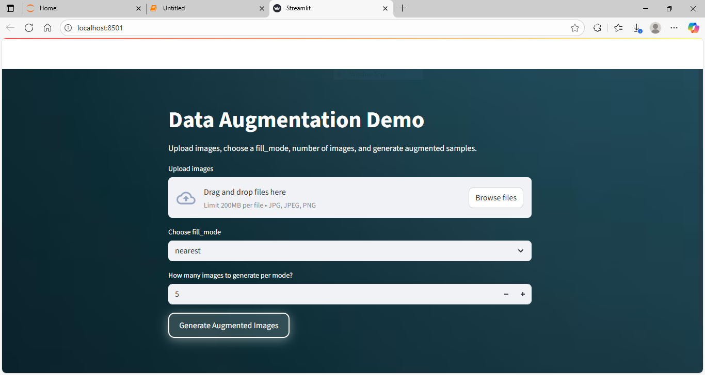
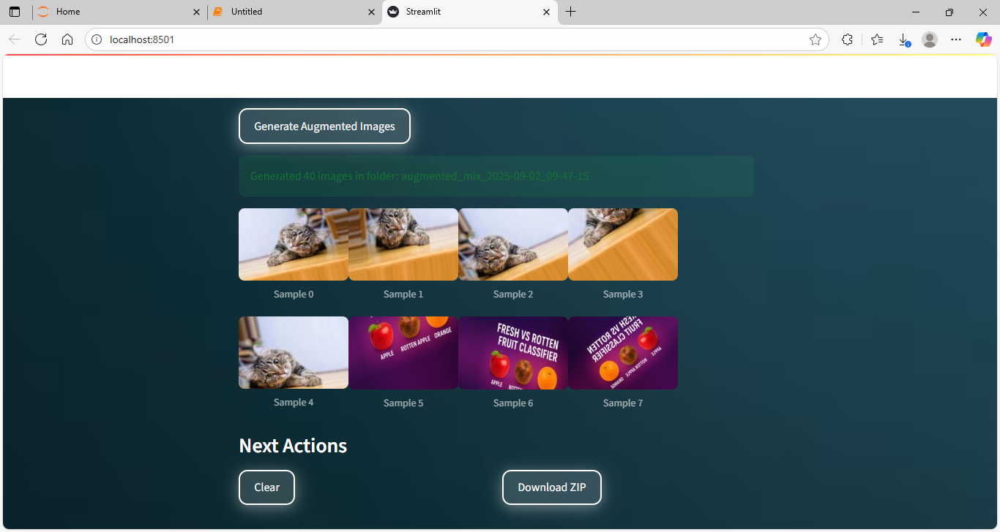

# Data Augmentation App

This project demonstrates **Data Augmentation** in Deep Learning with an interactive **Streamlit Web App**.  
You can upload one or more images, choose a `fill_mode`, and generate augmented samples for training deep learning models.  

---

## 📌 Features
- Upload **multiple images** (JPG, PNG).
- Choose from **4 fill modes** (`nearest`, `reflect`, `wrap`, `constant`) or use **Mix Mode** (all together).
- Set how many augmented images to generate per input image.
- Preview augmented samples instantly.
- Download all results as a **ZIP file**.
- Beautiful **custom UI** with background, glowing buttons, and floating cards.

---

## 🚀 How to Run
1. Clone this repo or copy the code.
2. Install dependencies:
   ```bash
   pip install -r requirements.txt

3 . Run the app:
```bash
streamlit run app.py
```

---

## 📂 Project Structure

```
Data_Aurgumentaion/
│── app.py              # Streamlit app
│── bg.avif             # Background image
│── Output/             # Folder with screenshots
│── Day78_Data_Augmentation.ipynb  # Documentation notebook
│── requirements.txt    # Dependencies
```

---

## 📸 Screenshots

### 1️⃣ Overall App Look



### 2️⃣ Upload Images & Select Mode


### 3️⃣ Augmented Images Generated



---

## 🧠 What is Data Augmentation?

Data Augmentation is the process of **increasing the diversity of your training dataset** by applying small, realistic transformations to existing data.
This improves the **robustness** and **generalization** of machine learning models.

Examples include:

* Rotations, flips, zooms for images
* Synonym replacement or back-translation for text
* Adding noise or scaling for signals

---

## 🙌 Acknowledgements

* **TensorFlow/Keras** for image augmentation tools.
* **Streamlit** for making interactive ML apps simple.

---

## 📌 Author

👤 **Akshay Bhujbal**
🎯 Learning Deep Learning & MLOps | Building daily projects
