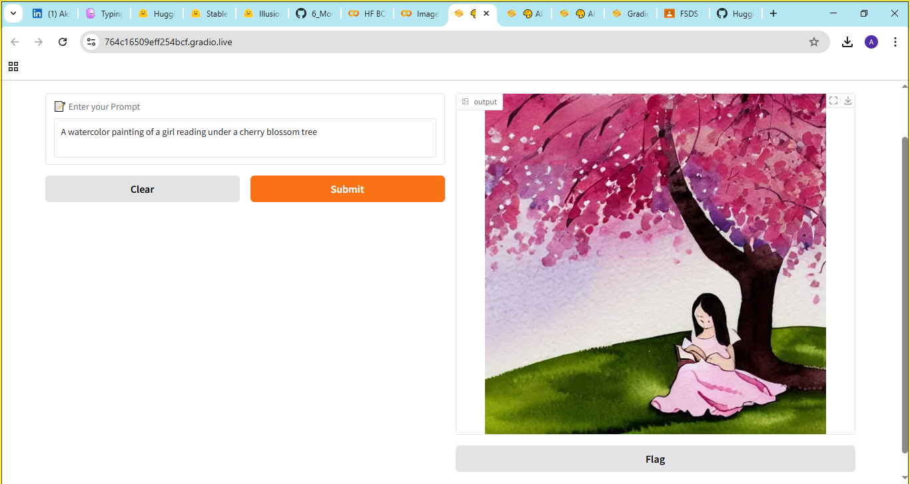

# 🎨 Image Generation using Stable Diffusion and Gradio

This project creates an **AI-powered image generator** using the `Stable Diffusion v1.5` model from Hugging Face. The app takes a text prompt and generates a high-quality image based on it, all through a simple Gradio interface.

---

## 🎯 Objective

- Use Hugging Face’s `runwayml/stable-diffusion-v1-5` model
- Deploy a text-to-image generator web app using Gradio

---

## ⚙️ Environment Setup

✅ Recommended: **Google Colab with GPU**

```bash
pip install diffusers transformers accelerate gradio
````

---

## ▶️ How to Run

```bash
python app.py
```

In Google Colab:

1. Open the notebook.
2. Go to `Runtime > Change runtime type > GPU`.
3. Paste and run the code.

---

## ✏️ Example Prompts

* `"A panda astronaut floating through a galaxy of jellybeans"`
* `"A dragon flying over a neon city at night"`
* `"A steampunk cat reading a book in a Victorian library"`

---

## 🧠 Technologies Used

* Python
* Hugging Face Diffusers
* Stable Diffusion
* Gradio
* PyTorch

---

## 📸 Output Preview



---
