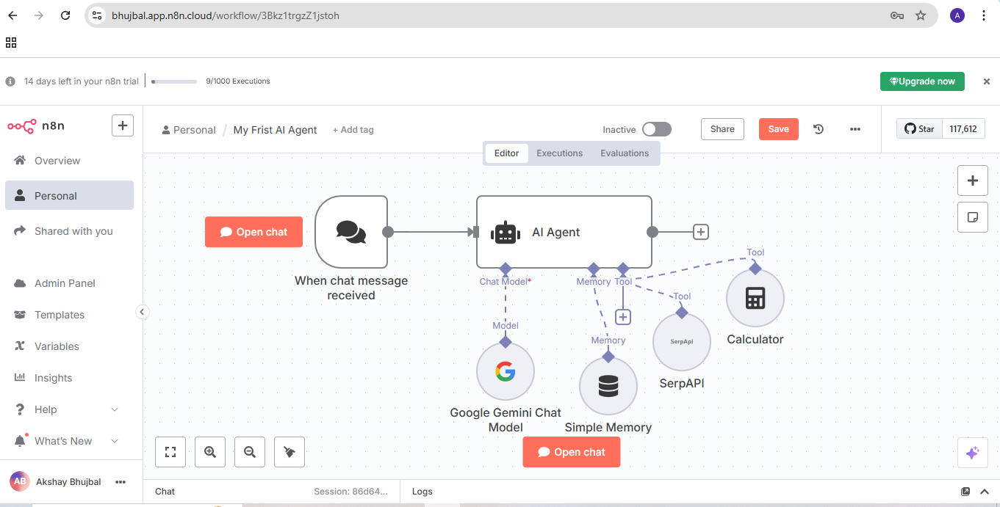
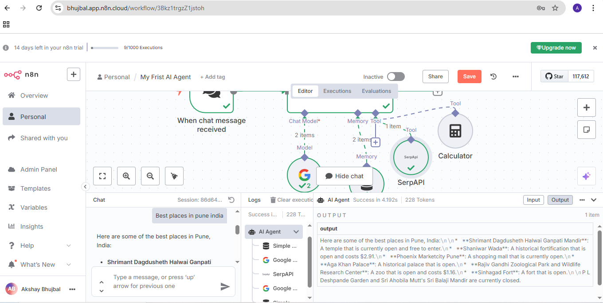
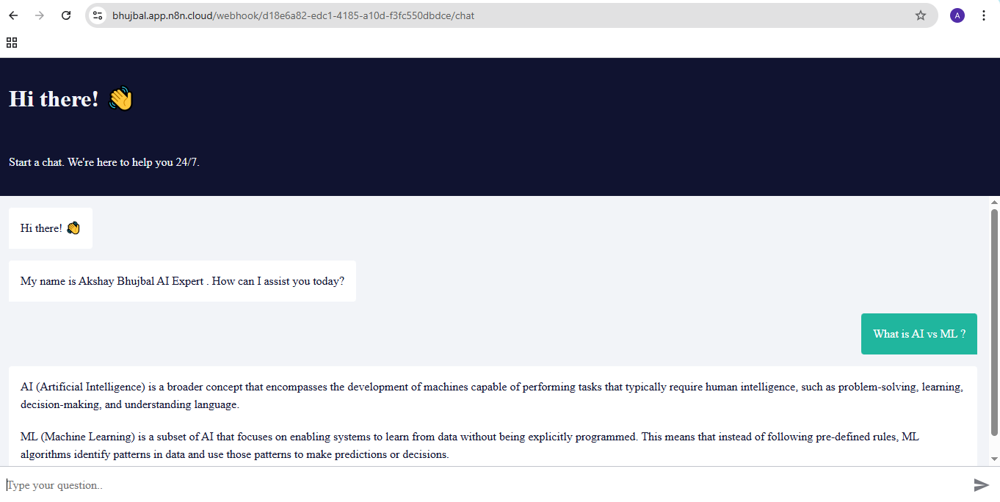

# First AI Agent – Chat UI with Real-Time Tools (n8n + Gemini)

Welcome to my first AI Agent project! This assistant is built using **n8n**, connected to the **Gemini AI model**, enhanced with real-time tools like **Calculator** and **Shark API**, and deployed via a simple **HTML-based Chat Interface**.

---

## 🔧 What I Did

1. Logged into [n8n.cloud](https://n8n.cloud) and created a new workflow.
2. Used the **Import Chat Agent** feature.
3. Connected the agent to the **Gemini model** via API.
4. Added:
   - ✅ **Calculator tool** to handle real-time calculations (e.g. 17% of 2999)
   - ✅ **Shark API** (real-time external data access using my API key)
   - ✅ **Memory module** to let the agent remember context between interactions
5. Asked a question → and the agent responded correctly!
6. Ran the final webhook in a browser using a custom HTML UI.

---

## 🌐 Live Webhook Link

> `https://bhujbal.app.n8n.cloud/webhook/d18e6a82-edc1-4185-a10d-f3fc550dbdce/chat`

This webhook powers the frontend chatbot.

---

## 💬 AI Chat UI

The interface was built using plain **HTML + JavaScript**, styled simply, and directly connects to the webhook.

Users can:
- Type a question
- Click “Ask”
- Instantly get a real-time response from the n8n-powered AI

---

## 📸 Screenshots

### 1. AI Agent Setup in n8n


---

### 2. AI Agent Responding in Workflow


---

### 3. Agent Working in Browser (Chat UI)


---

## 📂 Folder Structure

```

MyFirstAIAgentChatBox/
├── README.md
├── ai-agent-setup.png
├── ai-agent-working.png
└── ai-agent-browser.png

```

---

## 🚀 Future Ideas

- Add voice input 🎙️  
- Switch to OpenAI or Gemini Pro for richer replies 🤖  
- Deploy on custom domain (e.g. akshayagent.com)

---

### Made with 💙 by Akshay Bhujbal


---
