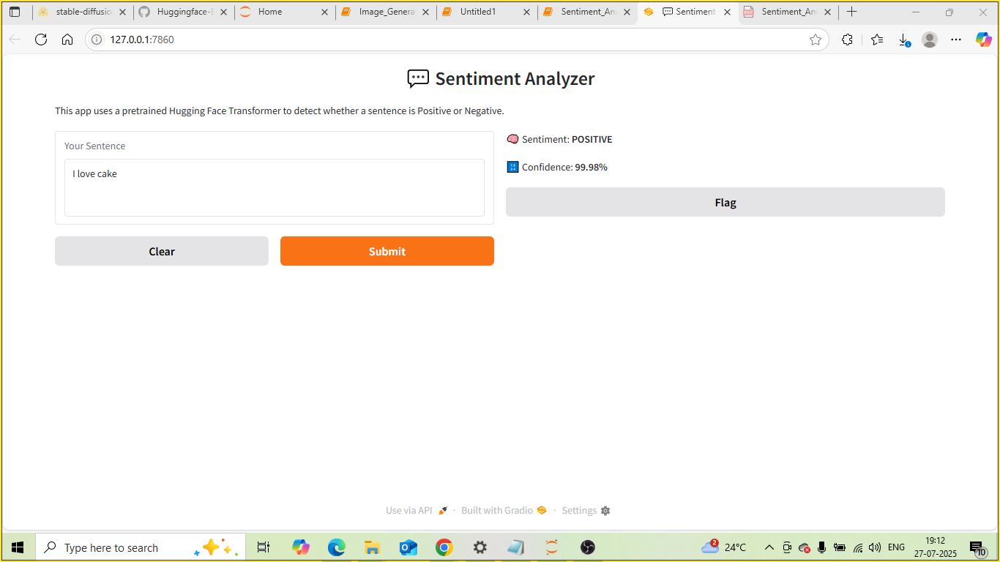

# 💬 Sentiment Analysis using Hugging Face and Gradio

This project builds a real-time sentiment analysis app using Hugging Face's Transformers library. It predicts whether a sentence expresses **positive** or **negative** sentiment and displays the result using a clean Gradio interface.

---

## 🎯 Objective

- Use a pretrained transformer (`distilbert-base-uncased-finetuned-sst-2-english`)
- Create a fast and interactive web app to classify sentiment from text

---

## ⚙️ Environment Setup

✅ Recommended: **Google Colab with GPU enabled**

```bash
pip install transformers gradio
````

---

## ▶️ How to Run

```bash
python app.py
```

In Google Colab:

1. Open your notebook.
2. Go to `Runtime > Change runtime type > GPU`.
3. Paste the code and run all cells.

---

## 📋 Example Inputs

* `"I love Hugging Face and its models!"`
* `"This app is boring and I hate it."`

---

## 🧠 Technologies Used

* Python
* Hugging Face Transformers
* Gradio

---

## 📸 Output Preview



---

