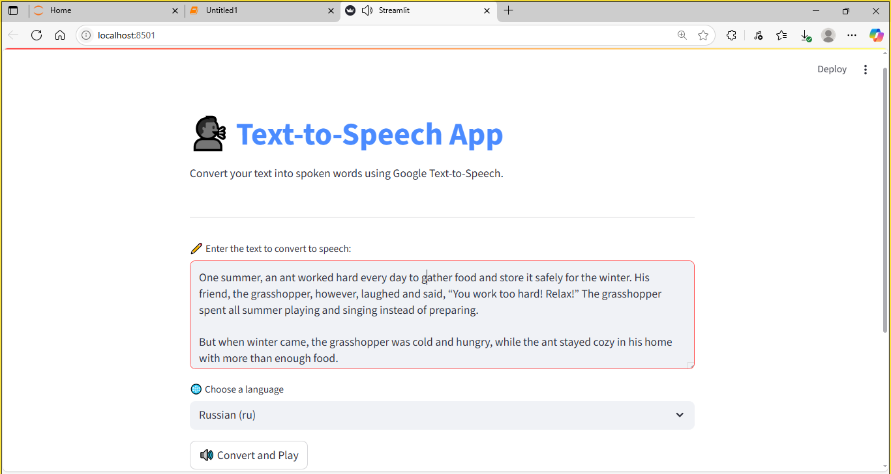

## 🗣️ Text-to-Speech App using gTTS & Streamlit

Convert any text into natural-sounding speech in multiple languages using Python, Google Text-to-Speech (`gTTS`), and Streamlit.

---

### 🚀 Features

* ✅ Convert text to speech using `gTTS`
* 🌍 Supports 50+ languages (English, Hindi, Marathi, French, etc.)
* 🎧 Listen to the generated voice in the browser
* ⚡ Simple and fast web interface with **Streamlit**
* 📝 Clean UI with language selection and text box

---

### 📸 Preview




---

### 📂 Project Structure

```
text-to-speech-gtts-streamlit/
│
├── tts_output.mp3            # Generated speech file (temporary)
├── poly_app.py               # Streamlit application
├── requirements.txt          # Required Python libraries
├── README.md                 # Project documentation (this file)
└── ...
```

---

### 📦 Requirements

* Python 3.7 or above
* `gtts`
* `streamlit`

---

### 🛠️ Installation

```bash
git clone https://github.com/yourusername/text-to-speech-gtts-streamlit.git
cd text-to-speech-gtts-streamlit
pip install -r requirements.txt
```

---

### ▶️ Run the App

```bash
streamlit run text_to_speech_app.py
```

Then open your browser at: [http://localhost:8501](http://localhost:8501)

---

### 🌐 Supported Languages

* English (`en`), Hindi (`hi`), Marathi (`mr`), French (`fr`), Spanish (`es`), German (`de`), and more...
* Full list is available dynamically in the app dropdown

---

### 🧠 How It Works

* Uses `gTTS` (Google Text-to-Speech) to convert input text to `.mp3`
* Plays audio directly in Streamlit using `st.audio`
* Dropdown lets users choose language (auto-handled via `gtts.lang.tts_langs()`)

---

### 📌 Demo Ideas

You can try:

* Typing "Hello, how are you?" in English
* Typing "तुमचं नाव काय आहे?" in Marathi
* Typing "Bonjour, comment ça va?" in French

---

### 💡 Next Improvements

* 🔽 Add download button for generated `.mp3`
* 🎤 Add microphone input (speech-to-text)
* ☁️ Deploy on [Streamlit Cloud](https://streamlit.io/cloud)

---

### 🧑‍💻 Author

**Akshay Bhujbal**
Data Analyst | ML Explorer | Python Developer
📍 Pune, India


