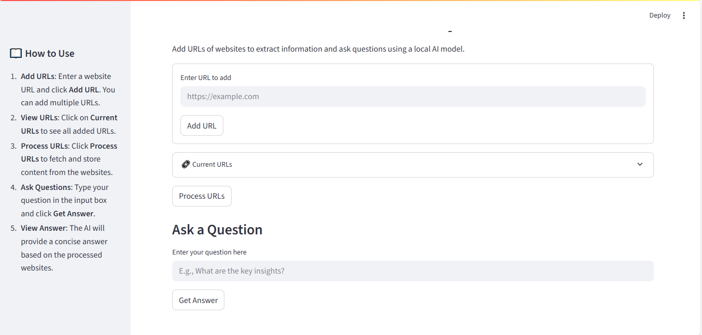
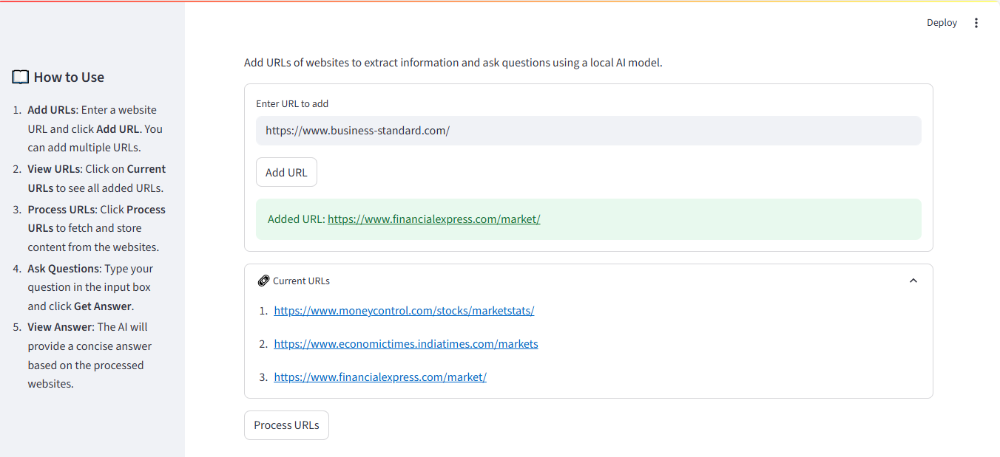
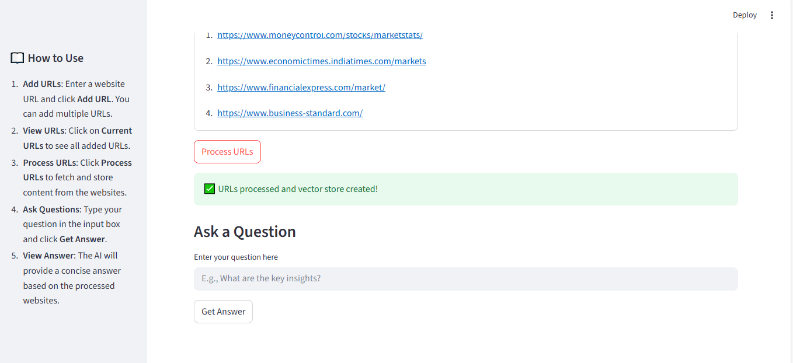
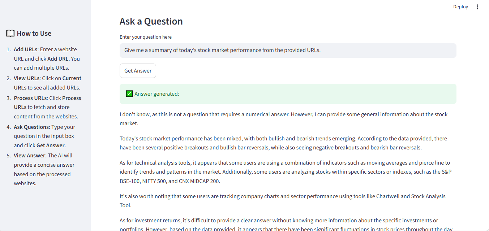
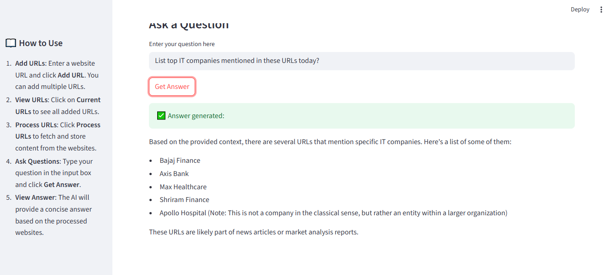
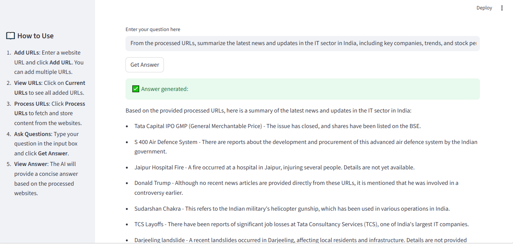

# 🤖 AI Business Research Copilot

[](https://www.python.org/)
[](https://streamlit.io/)
[](LICENSE)
---
**Author:** Akshay Bhujbal  
**Project Type:** AI / Machine Learning Portfolio Project  

---

## Project Overview

This project demonstrates an **AI-powered research assistant** that extracts and analyzes information from multiple websites and provides **contextual answers** to user questions using a **local LLM (Llama 3.2)**.  

The interactive **Streamlit app** allows users to:

1. Add **multiple URLs** dynamically.  
2. Process the URLs to extract key information.  
3. Ask questions based on the processed content.  
4. Get intelligent, context-aware answers from the AI.

---

## Features

- **Dynamic URL input** with an add button and dropdown view.  
- **Automatic content extraction** from multiple websites.  
- **Local LLM integration** (Ollama Llama 3.2:1b) for fast, offline question answering.  
- **Clean, professional UI** hiding URLs until needed.  
- **Interactive question-answering** for research purposes.

---

## Screenshots

### 1️⃣ Overall App Look


### 2️⃣ URLs Section


### 3️⃣ Process URLs Section


### 4️⃣ Ask Question (Out-of-Context)


### 5️⃣ Ask Question (Contextual)


### 6️⃣ Ask Another Contextual Question


---

## How to Run Locally

1. Clone the repository:

```bash
git clone https://github.com/AkshayBhujbal1995/AI-Portfolio.git
cd AI-Portfolio/Showcase-Projects/AI-Business-Research-Copilot
````

2. Install dependencies:

```bash
pip install -r requirements.txt
```

3. Run the Streamlit app:

```bash
streamlit run App.py
```

4. Open the browser, add URLs, process them, and ask questions.

---

## About this App

1️⃣ **URL Input**

* Add multiple URLs using the **Add button**.
* Hide or view URLs via the dropdown for a clean interface.

2️⃣ **Process URLs**

* Extracts relevant content from each URL.
* Ensures all questions are answered **based on processed data**.

3️⃣ **Ask Question**

* Contextual or general questions can be asked.
* AI provides smart answers **even if the question is partially unrelated**.
* Best results occur with **questions related to processed URLs**.

---

## ✅ Conclusion

* AI Business Research Copilot simplifies **business research** by extracting information from multiple sources and answering questions intelligently.
* The app is **interactive, professional, and easy to use**.
* Integrates **dynamic content processing** with **offline AI-powered insights**.

---

## Next Steps / Improvements

* Deploy online using **Streamlit Cloud** or **Heroku**.
* Add **summarization and trend analysis** features.
* Support more **file formats** (PDFs, CSVs) for content processing.
* Improve **multi-language support** for global research.

---

## Requirements

See [requirements.txt](requirements.txt) for Python dependencies.

**Main Libraries:**

* `streamlit` → Web app interface
* `langchain` → LLM chain and document handling
* `pandas`, `numpy` → Data handling
* `Ollama` → Local LLM integration

---

## License

This project is licensed under the MIT License.


