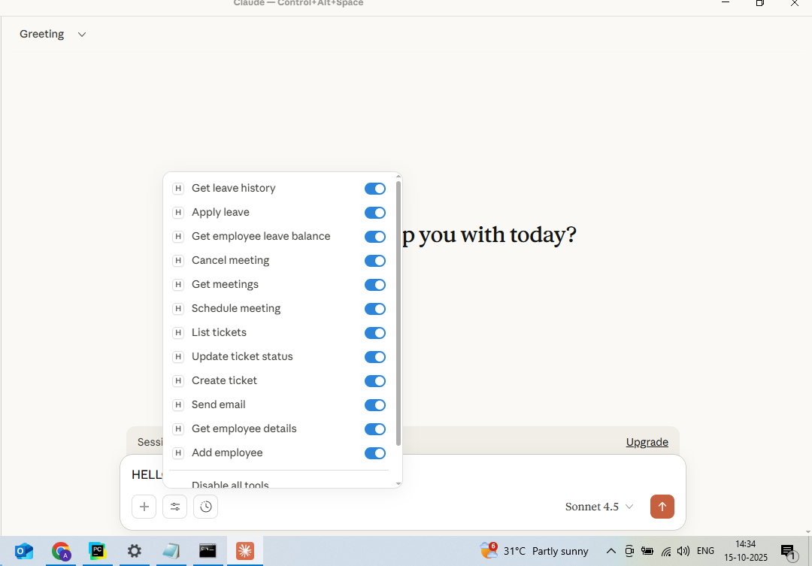
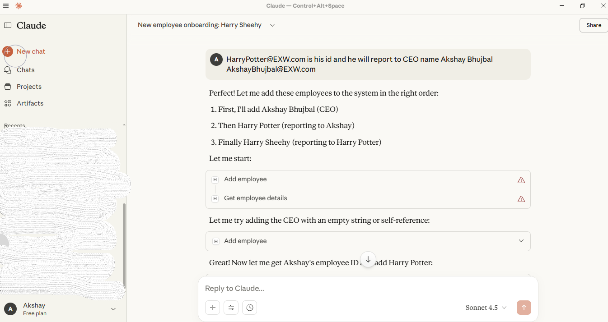
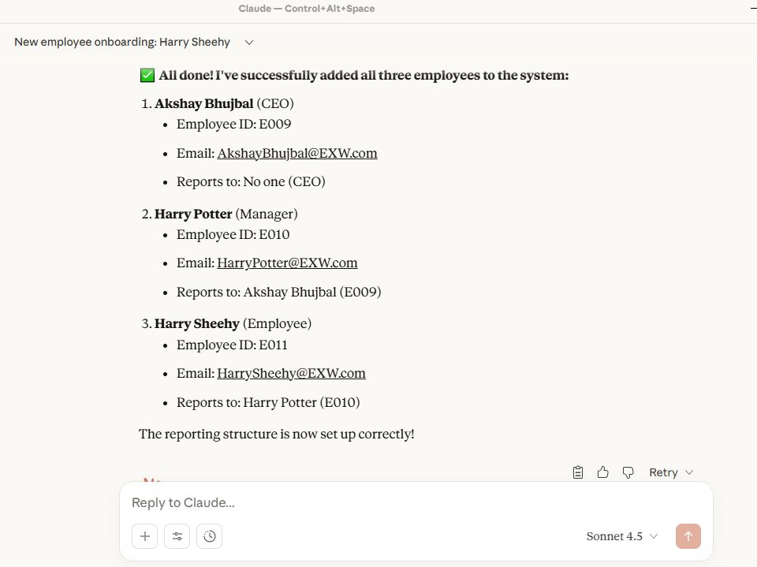
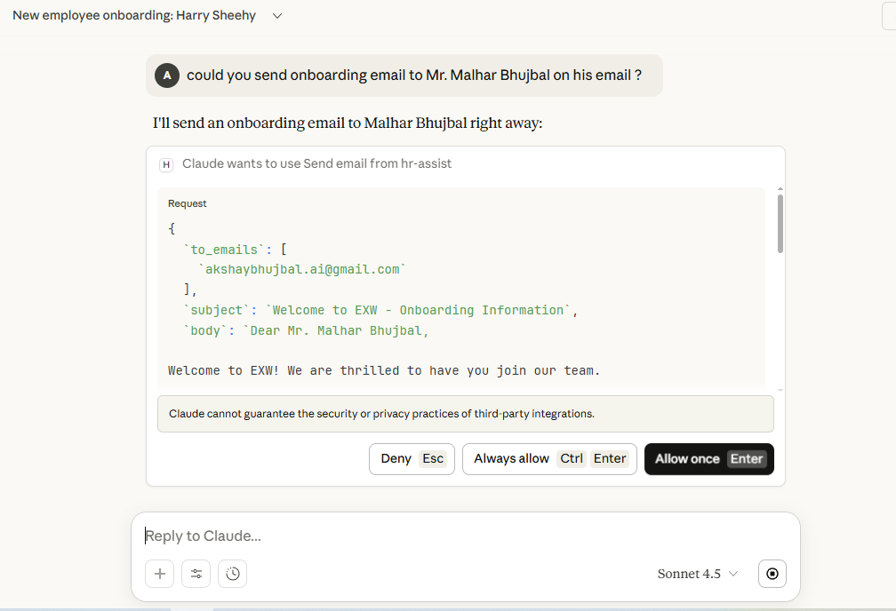
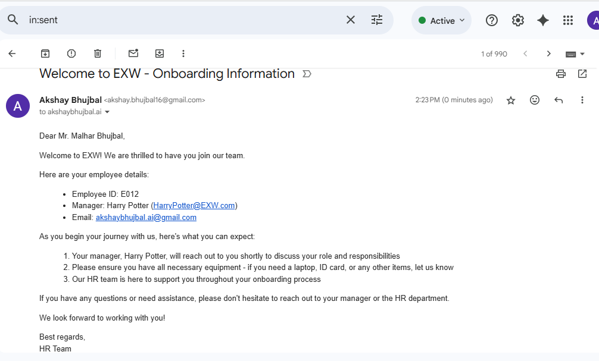
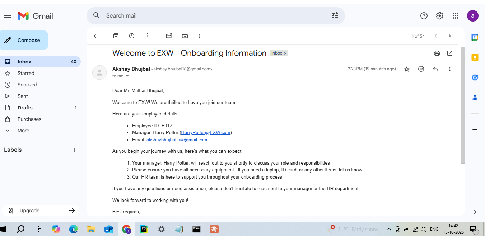

# 🤖 AI-Driven HR Onboarding Agent

[](https://www.python.org/)  
[](https://www.mcp.ai/)  
[](LICENSE)  

---

**Author:** Akshay Bhujbal  
**Project Type:** AI / Automation / HR Tech Portfolio Project  

---

## Project Overview

**AI-Driven HR Onboarding Agent (HR-ASSIST)** is an **Agentic AI system** designed to help HR teams **automate employee onboarding and HR workflows**. The system uses **MCP server–client architecture with Claude Desktop** to execute intelligent tasks, such as:

* Employee onboarding: create profiles, assign buddies, grant access  
* Leave management: get leave history, apply for leave, check leave balance  
* Meeting management: schedule meetings, cancel meetings, view meeting lists  
* Ticketing system: create tickets, update ticket status, view ticket list  
* Communication: send automated emails  
* Employee data retrieval: get employee details, add new employees  

A **Tools Dashboard** allows users to **view all available modules**, toggle them **on/off**, and manage workflow execution.

---

## Features

- **MCP Server–Client Integration** using Claude Desktop  
- **Automated HR workflows**: onboarding, leave, meetings, tickets, emails  
- **Dynamic Tools Dashboard**: see all available tools and toggle modules on/off  
- **Custom prompt handling** for flexible AI task execution  
- **Local data storage**: secure, independent from external software  
- **Screenshots workflow tracking** for key steps  

---

## Screenshots

### 1️⃣ Tools Dashboard


### 2️⃣ Add Employee


### 3️⃣ Send Email


### 4️⃣ Email Received


> ⚠️ Other tools are available in the **Claude Desktop Tools Dashboard**, but screenshots are not included here.  

---

## How to Run Locally

1. Clone the repository:

```bash
git clone https://github.com/AkshayBhujbal1995/AI-Portfolio.git
cd AI-Portfolio/Showcase-Projects/AI-Driven-HR-Onboarding-Agent
````

2. Configure `claude_desktop_config.json`:

```json
{
  "mcpServers": {
    "hr-assist": {
      "command": "C:\\Users\\Lenovo\\.local\\bin\\uv",
      "args": [
        "--directory",
        "C::\\code\\atliq-hr-assist",
        "run",
        "server.py"
      ],
      "env": {
        "CB_EMAIL": "YOUR_EMAIL",
        "CB_EMAIL_PWD": "YOUR_APP_PASSWORD"
      }
    }
  }
}
```

3. Replace `YOUR_EMAIL` and `YOUR_APP_PASSWORD` with your credentials.

4. Initialize MCP and add CLI:

```bash
uv init
uv add mcp[cli]
```

5. Launch **Claude Desktop**, click `+` → **Add from hr-assist**, fill employee details, and submit.

---

## Tools & Workflows

The agent includes the following **tools/modules**:

| Tool / Module           | Functionality                                                  |
| ----------------------- | -------------------------------------------------------------- |
| **Employee Onboarding** | Add employee, create profile, assign buddies, provision access |
| **Leave Management**    | Apply leave, get leave history, get leave balance              |
| **Meeting Management**  | Schedule meeting, cancel meeting, view meeting list            |
| **Ticketing System**    | Create ticket, update ticket status, list tickets              |
| **Communication**       | Send automated emails                                          |
| **Employee Data**       | Get employee details, add new employee                         |
| **Tools Dashboard**     | View all modules, enable/disable tools dynamically             |

> All modules can be managed in **Claude Desktop Tools Dashboard**.

---

## Tech Stack

* **Architecture:** MCP Server–Client (Claude)
* **Programming Languages:** Python / Node.js
* **Integration:** Local APIs, automation scripts, database triggers
* **Tools:** UV, Keka, Claude Desktop
* **Storage:** Local memory / database
* **Key Concepts:** Intelligent Agents, AI Workflow Automation, HR Tech, Task Orchestration

---

## ✅ Conclusion

* Automates **HR onboarding, leave, meeting, and ticket workflows**
* Increases efficiency and reduces manual effort
* Highlights real-world **AI, automation, and intelligent systems** skills
* Fully **resume-ready** and showcases technical expertise in **Agentic AI systems**

---

## Next Steps / Improvements

* Deploy as a **full desktop/web app** for HR teams
* Add **reporting dashboards** for employee onboarding and ticketing metrics
* Extend automation to **other HR functions** like payroll and performance tracking
* Add **multi-language support** for global HR teams


## License

This project is licensed under the MIT License.
