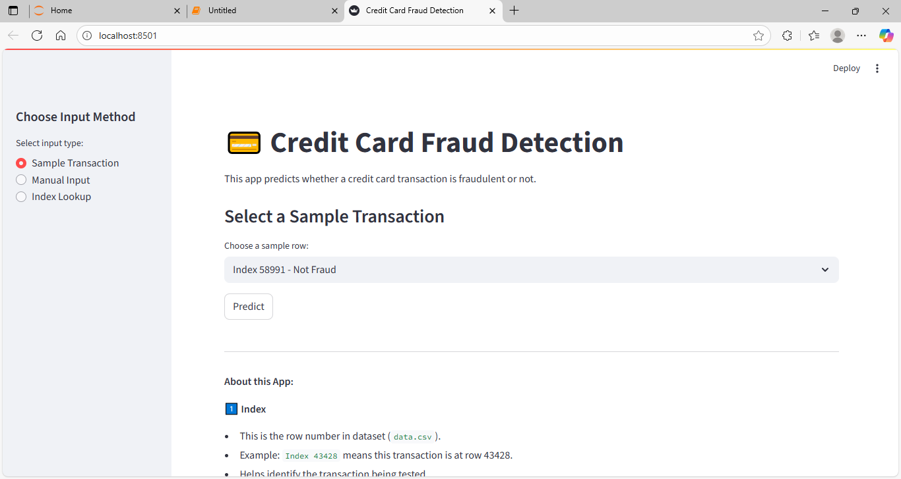
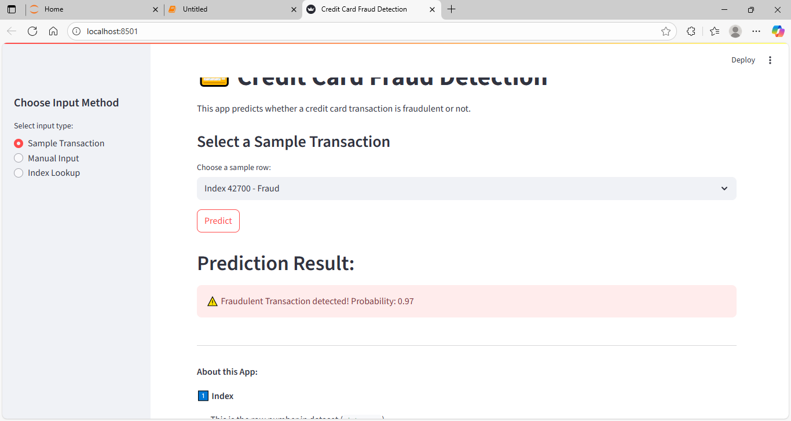
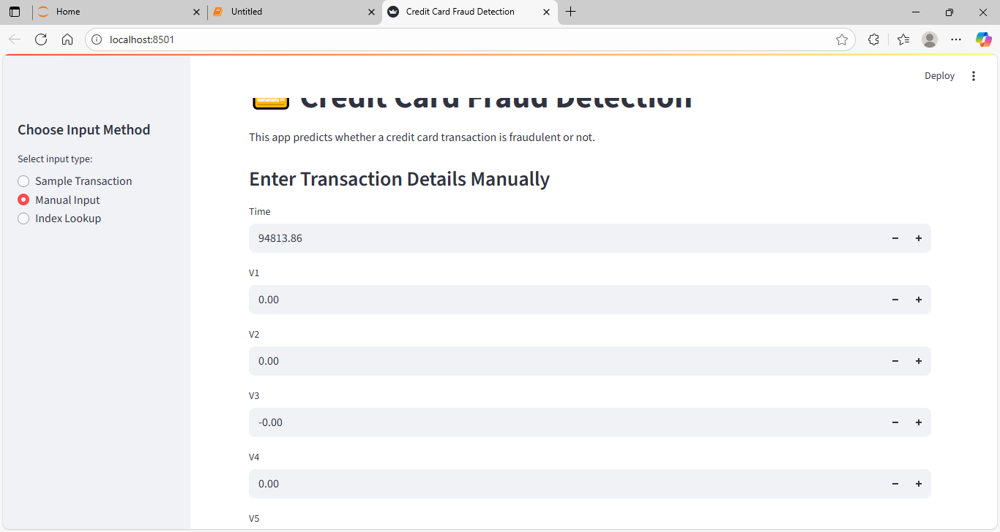
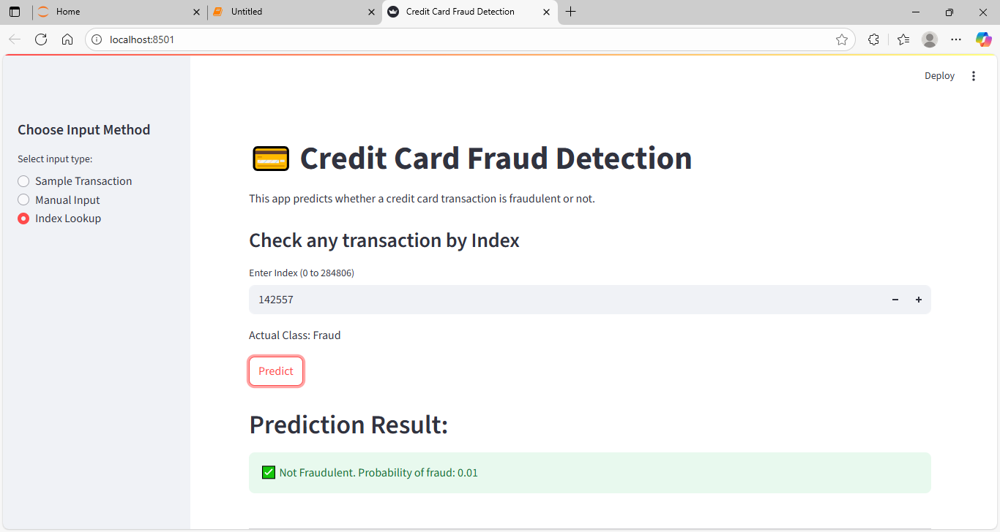

# 💳 Credit Card Fraud Detection

[](https://www.python.org/)
[](https://streamlit.io/)
[](LICENSE)
---
**Author:** Akshay Bhujbal  
**Project Type:** AI / Machine Learning Portfolio Project  

---

## Project Overview

This project demonstrates a **Credit Card Fraud Detection system** using a **Random Forest Classifier**.  
The interactive **Streamlit app** allows users to:

1. Select a **sample transaction** from the dataset.  
2. Enter **all 30 features manually**.  
3. Lookup **any transaction by its Index**.  

The model predicts whether a transaction is **fraudulent (1)** or **not fraudulent (0)**.  

---

## Features

- **Random Forest Classifier** trained on ~284,000 transactions.  
- **Interactive Streamlit app** for real-time testing.  
- Three input methods for flexibility:  
  - Sample Transaction  
  - Manual Input  
  - Index Lookup  

---

## Screenshots

### 1️⃣ App Overview


### 2️⃣ Sample Transaction


### 3️⃣ Manual Input


### 4️⃣ Index Lookup


---

## How to Run Locally

1. Clone the repository:

```bash
git clone https://github.com/AkshayBhujbal1995/AI-Portfolio.git
cd AI-Portfolio/Showcase-Projects/Credit-Card-Fraud-Detection
````

2. Install dependencies:

```bash
pip install -r requirements.txt
```

3. Run the Streamlit app:

```bash
streamlit run app.py
```

4. Open the link in your browser, choose an input method, and test predictions.

---

## Dataset

* Dataset: [Credit Card Fraud Detection](https://www.kaggle.com/datasets/mlg-ulb/creditcardfraud)
* Features: `Time`, `V1`–`V28`, `Amount`
* Target: `Class` (0 = Not Fraud, 1 = Fraud)

**Instructions:**
Download the dataset from Kaggle and place the file here:
`AI-Portfolio/Showcase-Projects/Credit-Card-Fraud-Detection/data/creditcard.csv`

---

## About this App

1️⃣ **Index**

* This is the **row number** in the dataset (`data.csv`).
* Example: `Index 43428` → transaction at row 43428.

2️⃣ **Class**

* Label in the dataset:

  * 0 → Not Fraudulent
  * 1 → Fraudulent
* Example: `Class 1.0` means the transaction is actually a fraud.

3️⃣ **Why show Index and Class?**

* Helps users test if the model prediction matches the actual label.
* Dropdown shows **5 sample transactions** (1 fraud + 4 non-fraud) for quick testing.

---

## ✅ Conclusion

* Random Forest Classifier detects fraudulent transactions with **high accuracy**.
* The interactive Streamlit app allows **flexible testing**: sample transactions, manual input, or index lookup.
* This project is part of my **AI portfolio**, showcasing skills in **Machine Learning, Data Analysis, and Application Development**.

---

## Next Steps / Improvements

* Deploy the app online using **Streamlit Cloud** or **Heroku**.
* Add **feature importance visualization** for model explainability.
* Compare predictions with **other ML models** like Logistic Regression or XGBoost for benchmarking.

---

## Tech Stack

* **Python**
* **Pandas, NumPy** for data manipulation
* **Scikit-learn** for Machine Learning
* **Streamlit** for building the interactive web app


