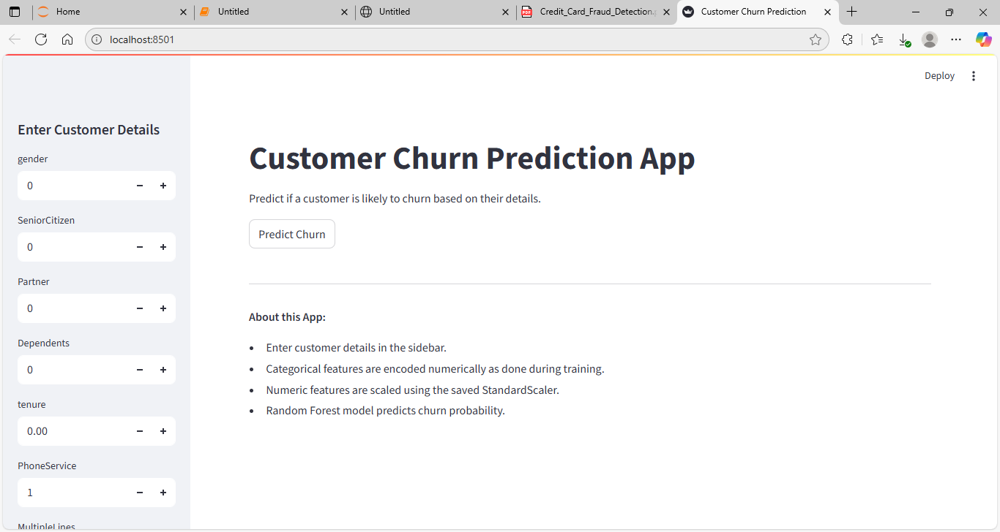
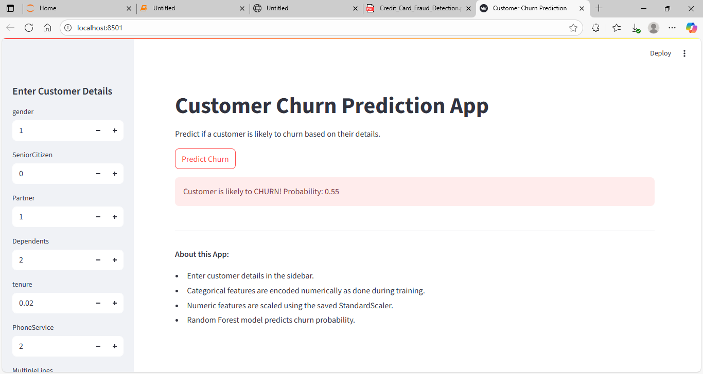
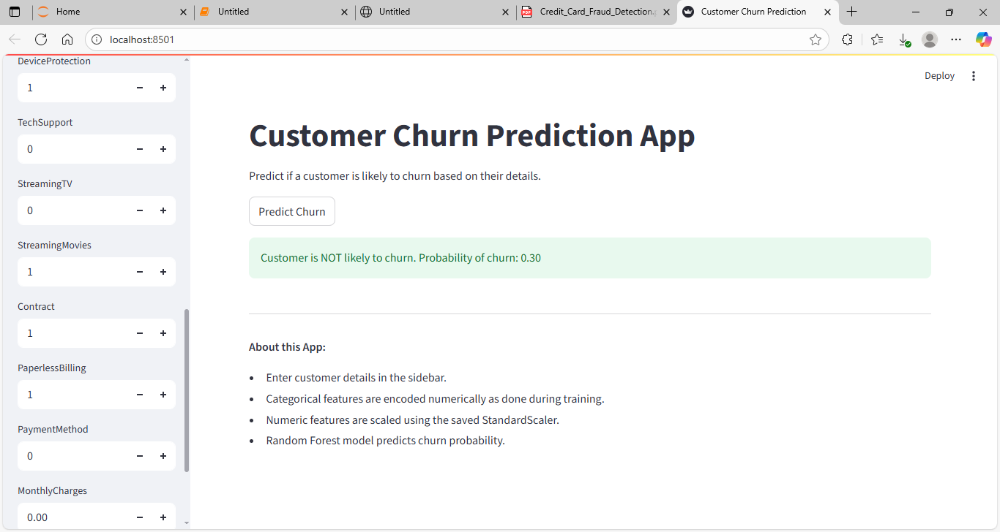

# Customer Churn Prediction Project

[](https://www.python.org/)
[](https://streamlit.io/)
[](LICENSE)

**Author:** Akshay Bhujbal  
**Project Type:** AI / Machine Learning Portfolio Project  

---

## 1. Project Overview
The **Customer Churn Prediction Project** is a machine learning application designed to predict whether a customer is likely to churn or remain loyal based on their profile and service usage.  

The system is built using a **Random Forest Classifier**, which works well with both categorical and numerical data. The app is interactive, built using **Streamlit**, and allows users to input customer details to get instant churn predictions.  

**Key Features:**
- Input customer details through an intuitive sidebar interface.
- Predict churn probability in real-time.
- Explore which features most influence customer churn.
- Works with preprocessed and scaled features, consistent with training.

---

## 2. Dataset
The model is trained on the **IBM Telco Customer Churn dataset** from Kaggle.  

**Dataset link:** [Telco Customer Churn](https://www.kaggle.com/blastchar/telco-customer-churn)  

**Dataset Description:**
- **Rows:** 7043  
- **Columns:** 21 (including `Churn`)  
- Mix of categorical (e.g., `Gender`, `Contract`) and numerical features (e.g., `MonthlyCharges`, `TotalCharges`).  

---

## 3. Screenshots

### 3.1 App Overview


### 3.2 Customer Likely to Churn


### 3.3 Customer Not Likely to Churn


---

## 4. Installation

**1. Clone the repository:**
```bash
git clone <your_repo_link>
cd Customer-Churn-Prediction
````

**2. Create a virtual environment (recommended):**

```bash
python -m venv venv
source venv/bin/activate   # Mac/Linux
venv\Scripts\activate      # Windows
```

**3. Install dependencies:**

```bash
pip install -r requirements.txt
```

**4. Run the Streamlit app:**

```bash
streamlit run app.py
```

---

## 5. Model Details

**Algorithm:** Random Forest Classifier
**Key Parameters:**

* `n_estimators = 200`
* `class_weight = 'balanced'` (handles churn/no-churn imbalance)

**Evaluation Metrics:**

```
Accuracy: 0.7856
Confusion Matrix:
[[928 107]
 [195 179]]
Precision, Recall, F1-Score:
- Non-Churn (0): Precision=0.83, Recall=0.90, F1=0.86
- Churn (1): Precision=0.63, Recall=0.48, F1=0.54
```

**Feature Importance:**
The most influential features for churn include `tenure`, `Contract type`, and `MonthlyCharges`.

---

## 6. Future Improvements

* Use **SMOTE** or **other oversampling techniques** to handle class imbalance better.
* Hyperparameter tuning to improve recall for churn class.
* Experiment with other algorithms such as **XGBoost** or **LightGBM** for improved performance.

---

## 7. Requirements

See [requirements.txt](requirements.txt) for all Python dependencies.

**Main Libraries:**

* `pandas`, `numpy` → Data handling
* `scikit-learn` → Modeling and preprocessing
* `matplotlib`, `seaborn` → Visualization
* `streamlit` → Web app interface

---

## 8. License

This project is licensed under the MIT License.

