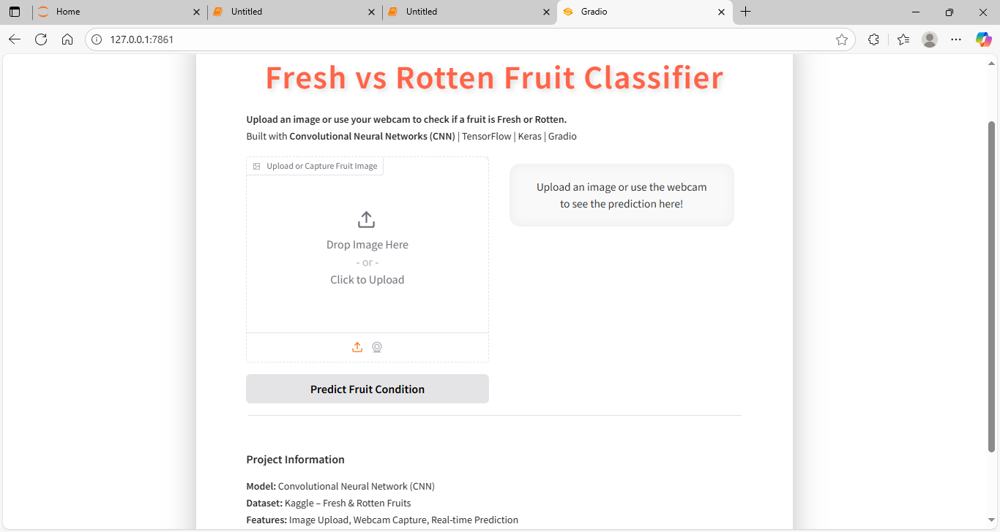
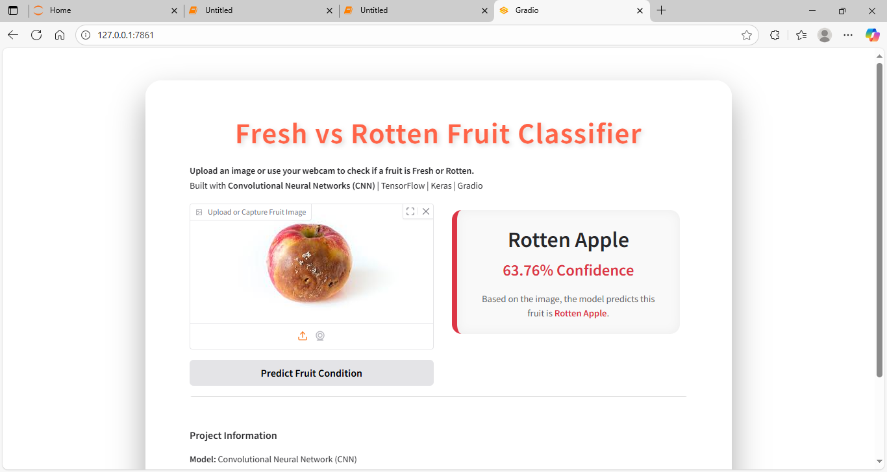
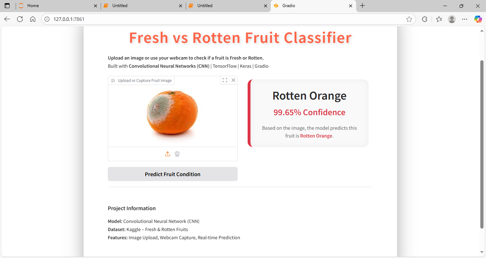

# 🍎 Fruit Quality Detection

[](https://www.python.org/)
[](https://www.tensorflow.org/)
[](LICENSE)

---

**Author:** Akshay Bhujbal  
**Project Type:** AI / Deep Learning Portfolio Project  

---

## Project Overview

This project demonstrates a **Fruit Quality Detection system** using a **Convolutional Neural Network (CNN)**.  
The system predicts whether a fruit is **Fresh** or **Rotten** for three types of fruits:

- Apple
- Banana
- Orange

**Note:** The trained `model.h5` file is **not uploaded** due to its large size. You can train the model locally by running the notebook.

The interactive **Gradio app** allows users to:

1. Upload an image of a fruit.  
2. Predict whether it is **Fresh** or **Rotten**.  
3. Explore model predictions on sample images.  

---

## Features

- CNN model trained on a labeled fruit dataset.  
- **Gradio interface** for real-time image predictions.  
- Handles 3 fruit categories with two quality labels: Fresh / Rotten.  
- Data augmentation applied during training for better generalization.  

---

## Screenshots

### 1️⃣ App Overview


### 2️⃣ Result for Rotten Apple


### 3️⃣ Result for Rotten Orange


### 4️⃣ Result for Fresh Apple


---

## How to Run Locally

1. Clone the repository:

```bash
git clone https://github.com/AkshayBhujbal1995/AI-Portfolio.git
cd AI-Portfolio/Showcase-Projects/Fruit-Freshness-Classification
````

2. Install dependencies:

```bash
pip install -r requirements.txt
```

3. Open the Jupyter Notebook:

```bash
jupyter notebook notebook.ipynb
```

4. Train the model locally (optional, since `model.h5` is not included).

5. Launch the Gradio interface to test predictions:

```python
interface.launch()
```

---

## Dataset

* Dataset: [Fruits Fresh and Rotten for Classification](https://www.kaggle.com/datasets/sriramr/fruits-fresh-and-rotten-for-classification)
* Categories: Apple, Banana, Orange
* Labels: `Fresh`, `Rotten`

**Instructions:**
Download the dataset and place it in the folder:
`Fruit_Quality_Detection/dataset/`

---

## About this App

1️⃣ **Prediction**

* Upload a fruit image.
* Model predicts **Fresh** or **Rotten** with confidence score.

2️⃣ **Sample Images**

* Preloaded sample images help users test the model quickly.

3️⃣ **Why CNN?**

* Convolutional Neural Networks are ideal for image classification tasks.
* Extract features like color, texture, and shape to differentiate fruit quality.

---

## ✅ Conclusion

* CNN model successfully classifies fruits as **Fresh** or **Rotten**.
* Gradio interface provides a **user-friendly way** to test predictions.
* This project demonstrates skills in **Deep Learning, Image Classification, and Application Deployment**.

---

## Next Steps / Improvements

* Deploy the app online using **Gradio Hub** or **Streamlit**.
* Include more fruit types for larger coverage.
* Add **explainability visualizations** like Grad-CAM to show model attention.
* Compare with other models (ResNet, EfficientNet) for improved accuracy.

---

## Requirements

See [requirements.txt](requirements.txt) for all Python dependencies.

**Main Libraries:**

* `tensorflow`, `keras` → Model building and training
* `numpy`, `pandas` → Data handling
* `matplotlib` → Visualizations
* `gradio` → Web app interface

---

## License

This project is licensed under the MIT License.


