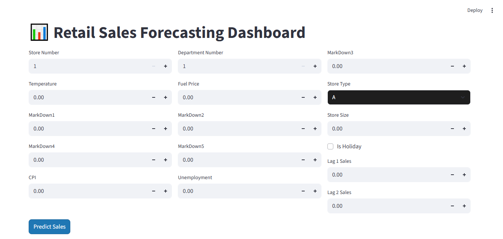
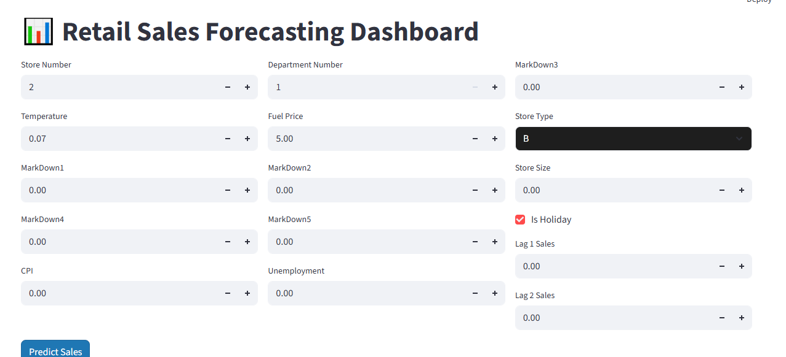
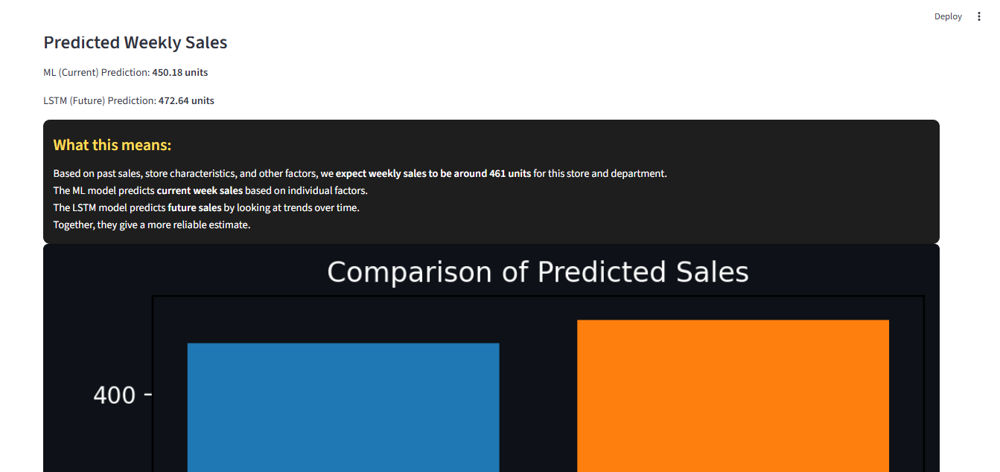
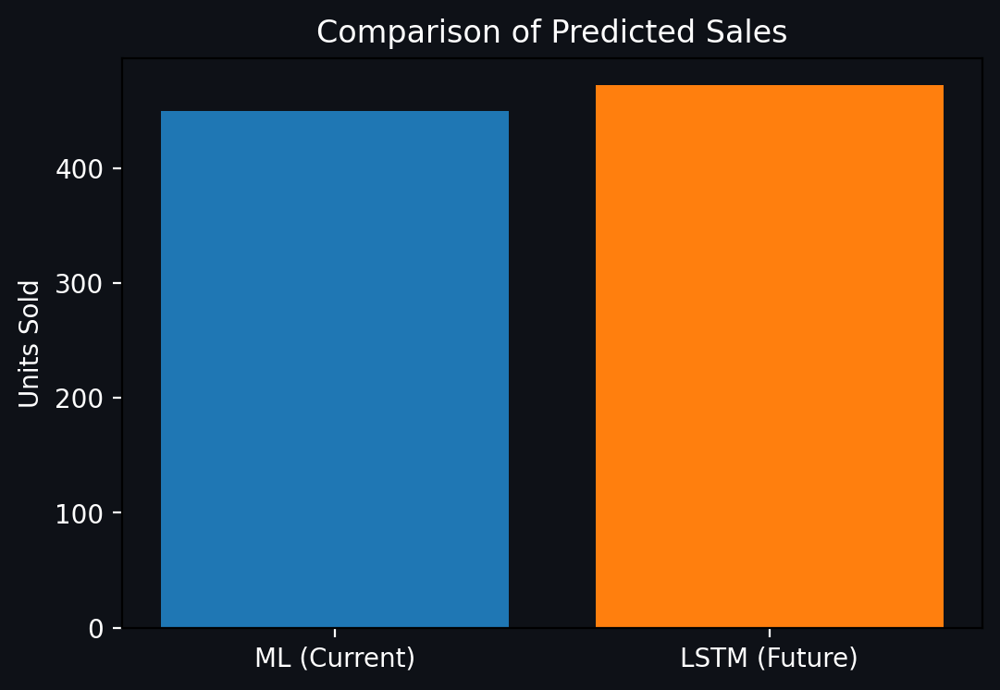

# Retail Sales Forecasting Project

[](https://www.python.org/)
[](https://streamlit.io/)
[](LICENSE)

**Author:** Akshay Bhujbal  
**Project Type:** AI / Machine Learning Portfolio Project  

---

## 1. Project Overview
The **Retail Sales Forecasting Project** is a machine learning application designed to predict weekly sales for stores and departments based on historical sales data, store characteristics, and other external factors.  

The system uses a combination of:
- **HistGradientBoostingRegressor (HGB)** → Feature-based model predicting current week sales.  
- **LSTM (Long Short-Term Memory)** → Sequence-based model predicting future sales trends.  

The app is interactive, built using **Streamlit**, allowing users to input store details and see predicted sales instantly.

**Key Features:**
- Input store, department, markdowns, and other relevant factors.  
- Predict weekly sales for current and future weeks.  
- Visual comparison of ML and LSTM predictions with an interactive chart.  
- Non-technical explanation of predictions for easy understanding.  

---

## 2. Dataset

The model is trained on the **Retail Dataset** from Kaggle: [Retail Dataset on Kaggle](https://www.kaggle.com/datasets/manjeetsingh/retaildataset)  

**Files Used:**
- `sales.csv` → Historical weekly sales (`Store`, `Dept`, `Date`, `Weekly_Sales`)  
- `features.csv` → External factors (`Store`, `Date`, `Temperature`, `Fuel_Price`, `Holiday_Flag`, `Promotion`)  
- `stores.csv` → Store metadata (`Store`, `Type`, `Size`)  

---

## 3. Screenshots

### 3.1 App Overview
  
*Main interface of the Retail Sales Forecasting app showing input fields and Predict button.*

### 3.2 Added Some Values
  
*Filled in store, department, markdowns, and other fields before prediction.*

### 3.3 Prediction Result
  
*Predicted weekly sales displayed for both ML (Current) and LSTM (Future).*

### 3.4 Graph Comparison
  
*Bar chart comparing ML (Current) vs LSTM (Future) predictions.*


---

## 4. Installation

**1. Clone the repository:**
```bash
git clone https://github.com/AkshayBhujbal1995/AI-Portfolio.git
cd AI-Portfolio/Showcase-Projects/Retail-Sales-Forecasting
````

**2. Create a virtual environment (recommended):**

```bash
python -m venv venv
source venv/bin/activate   # Mac/Linux
venv\Scripts\activate      # Windows
```

**3. Install dependencies:**

```bash
pip install -r requirements.txt
```

**4. Run the Streamlit app:**

```bash
streamlit run app.py
```

---

## 5. Model Details

**Algorithms Used:**

* **HistGradientBoostingRegressor (HGB)** → Current week sales
* **LSTM** → Future sales trends

**HGB Key Parameters:**

* `random_state = 42`
* Uses feature-based approach for weekly sales prediction

**LSTM Details:**

* Input shape = number of features
* Layers: LSTM(50 units) + Dense(1)
* Activation: ReLU, Optimizer: Adam

**Evaluation:**

* Both models scaled the input features and target using `StandardScaler`.
* Predictions are inverse-transformed to weekly sales units.

---

## 6. Future Improvements

* Improve LSTM model with more historical data and longer sequences.
* Hyperparameter tuning for HGB and LSTM to improve accuracy.
* Add more external factors such as promotions, holidays, and regional events.
* Deploy the app with interactive dashboards and exportable reports.

---

## 7. Requirements

See [requirements.txt](requirements.txt) for all Python dependencies.

**Main Libraries:**

* `pandas`, `numpy` → Data handling
* `scikit-learn` → Feature scaling and HGB modeling
* `tensorflow`, `keras` → LSTM modeling
* `matplotlib`, `seaborn` → Visualization
* `streamlit` → Web app interface

---

## 8. License

This project is licensed under the MIT License.

